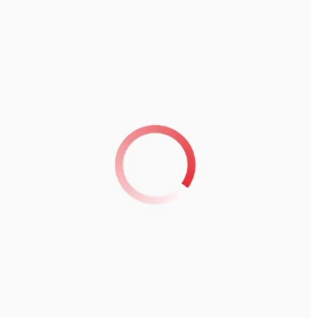

# flutter-gradient-circular-progress-indicator
A gradient 360-degree spinner (progress indicator) for Flutter



Usage:

```dart
GradientCircularProgressIndicator(
  radius: 50,
  gradientColors: [
    Colors.white,
    Colors.red,
  ],
  strokeWidth: 10.0,
),
```
